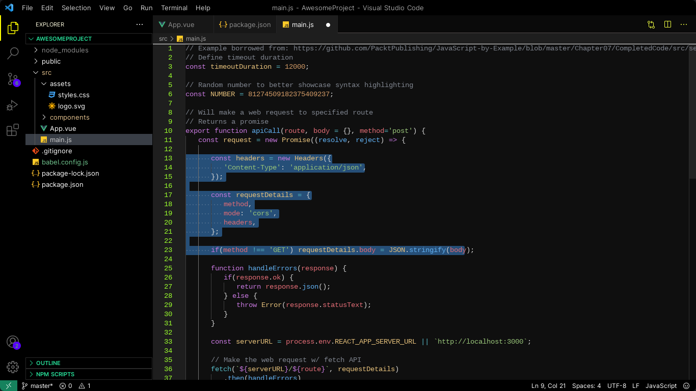

# Neon Night Dark Theme README

## Description

This extension for Visual Studio Code adds themes titled "Neon Night". There are dark theme..

> I personally use the dark themes for most occasions, but find the light theme good on some dimmer projectors when I present.

## Dark Theme (Preview)

## Usage

Select the theme and go!

## Installation

1. Open **Extensions** sidebar panel in Visual Studio Code. `View → Extensions`
1. Search for `Neon Night`
1. Click **Install**
1. Click **Reload**
1. File > Preferences > Color Theme > **Neon Night**
1. Optional: Use the recommended settings below for best experience

## Feedback

If you have suggestions, please [open an issue](https://github.com/iamnaveenoff/Neon-Night-VS-Code-Extension/issues) or better yet, a [pull request](https://github.com/iamnaveenoff/Neon-Night-VS-Code-Extension/pulls).

## Authors

Authored by [Naveen Kumar](https://iamnaveenoff)

Be nice.

## For more information

- [Home Page](https://iamnaveenoff.in/)
- [Contact](https://iamnaveenoff.in/)
- [Issue Tracker](https://github.com/iamnaveenoff/Neon-Night-VS-Code-Extension/issues)

**Enjoy!**
